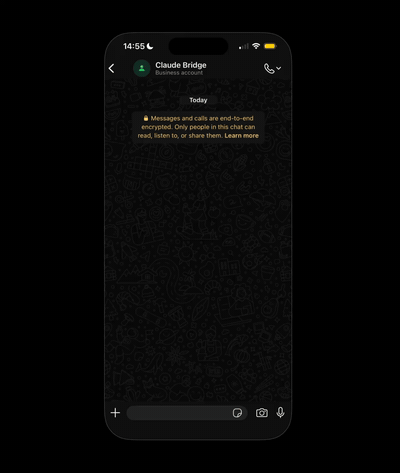

<p align="center">
  
</p>

<p align="center">
  <b>Connect your AI CLI to any messaging channel.</b><br>
  Your device stays closed. Your AI keeps working.
</p>

<p align="center">
  
</p>

<p align="center">
  <a href="#quickstart">Quickstart</a> ·
  <a href="#why">Why</a> ·
  <a href="#how-it-works">How it works</a> ·
  <a href="#comparison">Comparison</a> ·
  <a href="#roadmap">Roadmap</a>
</p>

---

`reverb` is a lightweight daemon that connects your AI CLI (Claude Code, Gemini CLI, or any AI assistant) to messaging channels (WhatsApp today, Telegram/Signal/Discord soon) with **real persistence** — it keeps running in the background, survives reboots, reconnects on network drops, and spawns `claude --print` on demand. You use your own Claude Code subscription. No API tokens. No Docker. No cloud.

Send yourself a WhatsApp message from the bus. Claude replies. Your machine was asleep the whole time.

## Why

Everyone building "Claude via WhatsApp" hits the same wall: **persistence**.

- **Official Claude Code channel plugins** (like the WhatsApp plugin approved in the Anthropic marketplace) load inside your Claude Code session. The moment you close Claude Code, the bridge dies. Useless when you're away from your desk.
- **Docker-based alternatives** do persist — at the cost of a 2–4 GB Linux VM running 24/7. Overkill.
- **Twilio / WhatsApp Business API solutions** require paid APIs and a business account.

`reverb` runs as a native daemon (~50 MB RAM). Auto-restarts on crash. Auto-reconnects on WhatsApp drops. Auto-starts on boot. Uses your existing Claude Code subscription via `claude --print`.

## Features

- 🔗 **WhatsApp** channel via multidevice linked-device protocol (no Business API, no phone number hosting)
- 🧱 **Native persistence** — LaunchAgent on macOS · systemd user service on Linux · Task Scheduler on Windows
- 🛡️ **Sandboxed execution** — Claude Code runs with a scoped working directory, not your entire `$HOME`
- 🚦 **Rate limiting** per chat (configurable; default 10 msgs / 60s)
- 📜 **Audit log** with hashed JIDs — every processed message recorded in `logs/audit.jsonl`
- 🛑 **Kill switch** — send `/stop` from your own WhatsApp to shut the bridge down
- 📎 **Response chunking** — long Claude responses split into multiple WhatsApp messages
- 🔒 **Local-only** — no cloud, no third-party servers, no telemetry

## Quickstart

### Prerequisites

- **macOS, Linux, or Windows** — Node.js 18+
- **Claude Code CLI** installed and authenticated (`claude login`)
- An active WhatsApp account on your phone with a free Linked Device slot (max 4)

### Install

**macOS / Linux**
```bash
git clone https://github.com/eusougustavocesar/reverb.git
cd reverb && npm install && npm run setup
```

**Windows**
```powershell
git clone https://github.com/eusougustavocesar/reverb.git
cd reverb; npm install; npm run setup
```

`npm run setup` builds the project, registers the background service for your OS (LaunchAgent / systemd / Task Scheduler), and starts it.

### Pair your phone

```bash
npm run pair
```

A QR code renders in your terminal. On your phone:

> **iOS:** WhatsApp › Settings › Linked Devices › Link a Device  
> **Android:** WhatsApp › ⋮ Menu › Linked Devices › Link a Device

Once you see `Connected to WhatsApp`, send yourself a test message. When Claude replies, hit `Ctrl+C` — the background service takes it from here.

That's it. The service now runs continuously, survives reboots, and your AI is a WhatsApp message away.

### Verify it's alive

**macOS**
```bash
launchctl list | grep reverb
tail -f /tmp/reverb.log
```

**Linux**
```bash
systemctl --user status reverb
journalctl --user -u reverb -f
```

**Windows**
```powershell
Get-ScheduledTask -TaskName "reverb" | Get-ScheduledTaskInfo
Get-Content "$env:APPDATA\reverb\reverb.log" -Tail 50
```

## How it works

```
        ┌────────────────────┐
        │  WhatsApp (phone)  │
        └─────────┬──────────┘
                  │  multidevice linked device (WebSocket)
                  ▼
        ┌────────────────────┐
        │    Baileys (Node)  │◄── runs as daemon, never sleeps
        │       reverb       │
        └─────────┬──────────┘
                  │  spawn subprocess on each message
                  ▼
        ┌────────────────────┐
        │  claude --print    │
        │  (your CC session) │
        └─────────┬──────────┘
                  │  stdout
                  ▼
        ┌────────────────────┐
        │   Reply to chat    │
        └────────────────────┘
```

**Why it works when the official plugin doesn't:** the daemon is a **separate process** from Claude Code itself. Claude Code starts, runs, exits — repeatedly — on demand. The bridge keeps the WhatsApp socket alive independently. You never need Claude Code open.

## Configuration

Everything lives in `.env`:

```env
# Path to Claude binary (run `which claude` to find yours)
CLAUDE_BIN=claude

# Sandboxed working directory (Claude can only read/write inside this)
CLAUDE_CWD=./workspace

# Empty MCP config — bypasses MCP server startup hang under headless daemon
CLAUDE_MCP_CONFIG=./empty-mcp.json

# Rate limit
RATE_LIMIT_MAX=10
RATE_LIMIT_WINDOW_SECONDS=60

# Allowed chats. Empty = only self-chat. Include both phone JID and LID.
# Example: "5511999999999@s.whatsapp.net,123456789012345@lid"
ALLOWED_JIDS=

# Session mode: "continue" (rolling session) | "none" (stateless)
SESSION_MODE=continue
```

See [`docs/configuration.md`](docs/configuration.md) for details and [`docs/troubleshooting.md`](docs/troubleshooting.md) for common issues.

## In-chat commands

- `/help` — list commands
- `/stop` — shut down the bridge (the background service auto-restarts; disable the service/task to stop permanently)

## Comparison

| | reverb | [Rich627/whatsapp-claude-plugin][rich627] | [osisdie/claude-code-channels][osisdie] | Twilio + API |
|---|:---:|:---:|:---:|:---:|
| Persistence (device can be closed) | ✅ | ❌ | ✅ | ✅ |
| Uses your Claude Code subscription (no API cost) | ✅ | ✅ | ✅ | ❌ |
| Runtime footprint | ~50 MB | 0 (inside Claude Code) | 2–4 GB (Docker) | N/A (cloud) |
| Installation | 1 script | `claude plugin install` | `docker compose up` | complex |
| macOS | ✅ | ✅ | ✅ | ✅ |
| Linux / VPS | ✅ | ❌ | ✅ | ✅ |
| Windows | ✅ | ❌ | ❌ | ✅ |
| Multi-channel | WA (+ Telegram/Signal planned) | WA only | WA + Telegram + Discord + Slack + LINE | any |
| Official Anthropic marketplace | not yet | ✅ | ❌ | ❌ |
| Open source | ✅ MIT | ✅ | ✅ | varies |

[rich627]: https://github.com/Rich627/whatsapp-claude-plugin
[osisdie]: https://github.com/osisdie/claude-code-channels

## Security

`reverb` gives a WhatsApp message access to Claude Code running on your machine. That's powerful — and risky — so the defaults are conservative:

- **Sandboxed `CLAUDE_CWD`** — defaults to `./workspace` inside the repo. Claude can only read/write inside it. Do NOT set it to `$HOME`.
- **Rate limiting** per chat (10 msgs / 60s).
- **ALLOWED_JIDS allowlist** — by default only your own self-chat works.
- **Audit log** with hashed JIDs in `logs/audit.jsonl`.
- **Kill switch** via `/stop`.

See [`docs/security.md`](docs/security.md) for threat model and hardening tips.

> ⚠️ `reverb` uses WhatsApp's multidevice (linked device) protocol via [Baileys](https://github.com/WhiskeySockets/Baileys). This is the same mechanism WhatsApp Web uses, but using it programmatically **may violate WhatsApp's Terms of Service**. Historical ban rate on low-volume personal use is very low, but non-zero. Use a dedicated number for heavy automation.

## Roadmap

- [x] v0.1 — WhatsApp channel, LaunchAgent (macOS), sandboxing, rate limiting
- [x] v0.1 — systemd user service (Linux/VPS), Task Scheduler (Windows)
- [ ] v0.2 — Telegram channel (plug-in adapter)
- [ ] v0.3 — Session per chat (multi-conversation context isolation)
- [ ] v0.4 — Media: audio (whisper transcription), images (vision)
- [ ] v0.5 — Slash commands framework (`/reset`, `/session new`, `/status`)
- [ ] v1.0 — Homebrew formula, signed release binaries

## Contributing

Issues and PRs welcome. Start by opening an issue to discuss larger changes. See [`CONTRIBUTING.md`](CONTRIBUTING.md).

## License

MIT — see [`LICENSE`](LICENSE).

## Acknowledgements

- [Baileys](https://github.com/WhiskeySockets/Baileys) — the whatsmeow-style TS client that does the real work
- [Anthropic Claude Code](https://claude.com/claude-code) — the CLI this bridges to
- Prior art: [Rich627/whatsapp-claude-plugin](https://github.com/Rich627/whatsapp-claude-plugin), [osisdie/claude-code-channels](https://github.com/osisdie/claude-code-channels), [RichardAtCT/claude-code-telegram](https://github.com/RichardAtCT/claude-code-telegram) — inspiration and reference points
